# Autoencoder ND - 1-6D Convolutional Layers

This project explores how convolutional autoencoders can be implemented with layers of different dimensionalities, from 1D to 6D. While we always start with the same 2D image data, we process it through neural networks whose internal layers operate on tensors of increasing dimensionality, 1D-6D.

This is an exploration with Cursor + Claude 3.7

## Project Overview

An autoencoder is a type of neural network that consists of two parts:
1. An **encoder** (a convolutional neural network that compresses the input)
2. A **decoder** (a transposed convolutional neural network that reconstructs the input)

Each higher-dimensional layer creates more connections between neurons, allowing for more complex pattern recognition across multiple dimensions simultaneously.

We start with a standard 2D grayscale image and process it using autoencoders with different layer dimensionalities:

1. **1D Autoencoder**: Flattens the 2D image into a 1D sequence for processing with 1D layers
2. **2D Autoencoder**: Processes the image directly with 2D layers
3. **3D Autoencoder**: Expands the image into a 3D volume for processing with 3D layers
4. **4D Autoencoder**: Creates a 4D representation for processing with 4D layers
5. **5D Autoencoder**: Creates a 5D representation for processing with 5D layers
6. **6D Autoencoder**: Creates a 6D representation for processing with 6D layers

Each implementation maintains the same architectural pattern:
- **Encoder**: 3 convolutional layers with stride 2 (1→8→4→4 channels)
- **Decoder**: 3 transposed convolutional layers with stride 2 (4→4→8→1 channels)

## Hierarchical Convolution Approach

For dimensions higher than 3D, we implement a hierarchical convolution approach:

- **3D and below**: Use PyTorch's native convolution and transposed convolution operations
- **4D**: Implement 4D convolutions using multiple 3D convolutions
- **5D**: Implement 5D convolutions using multiple 4D convolutions
- **6D**: Implement 6D convolutions using multiple 5D convolutions

This hierarchical approach demonstrates how convolution operations can be extended to arbitrarily high dimensions. Also note the actual dimensions of the encoders is 2 higher due to how convolutional neural networks are implemented as it's comprised of spatial dimensions and I/O channel dimensions.

## Reconstruction

Each model attempts to reconstruct the original image. Below are the reconstruction results:

| 1D Layer | 2D Layer |
|:---:|:---:|
| 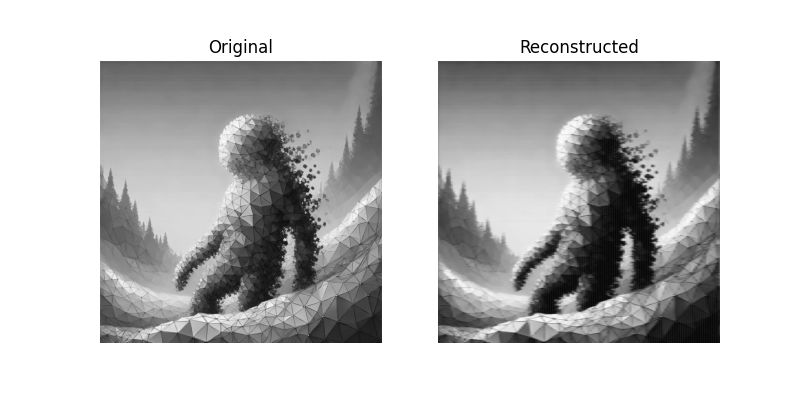 |  |

| 3D Layer | 4D Layer |
|:---:|:---:|
| 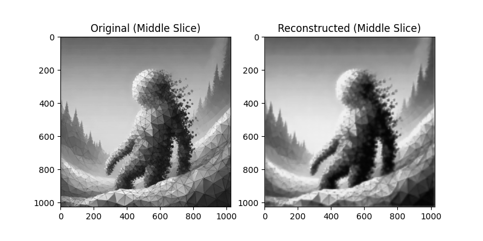 | 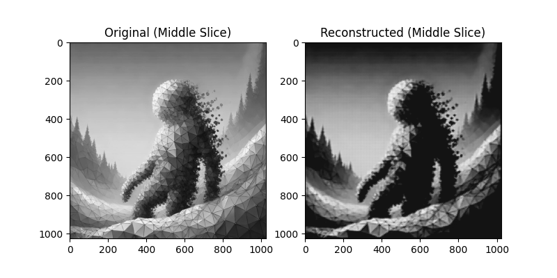 |

| 5D Layer | 6D Layer |
|:---:|:---:|
|  | 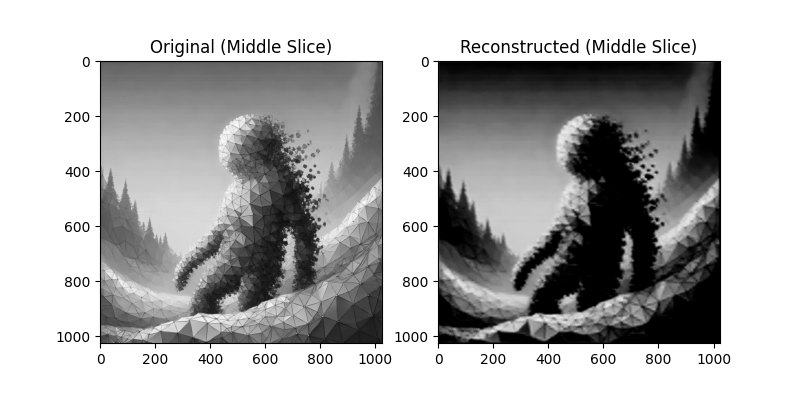 |

### Training Loss

Each model was trained for 500 epochs on the same input image. Below is the combined training loss curve for all dimensions:

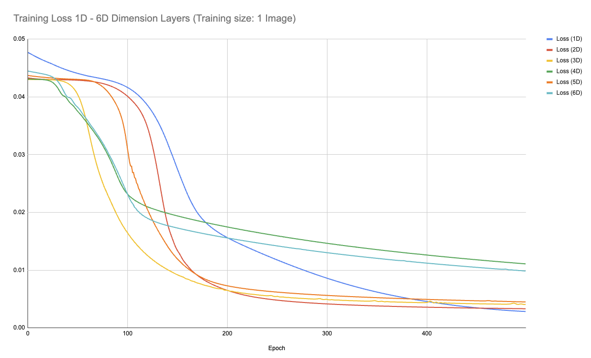

Below are the individual training loss curves:

| 1D Layer | 2D Layer |
|:---:|:---:|
| 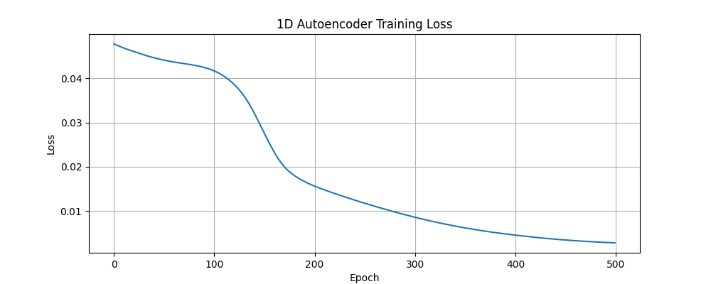 | 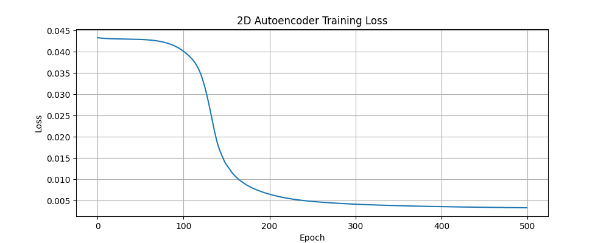 |

| 3D Layer | 4D Layer |
|:---:|:---:|
| 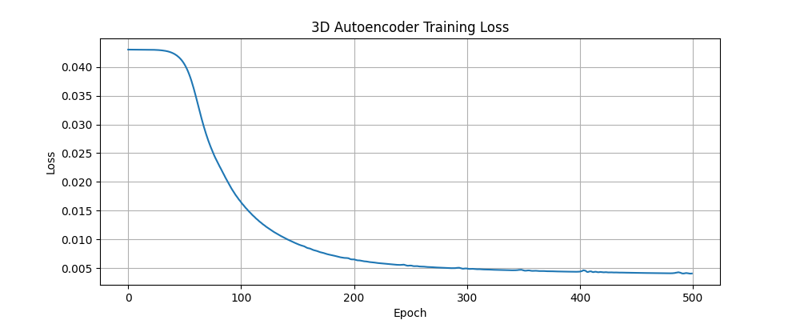 | 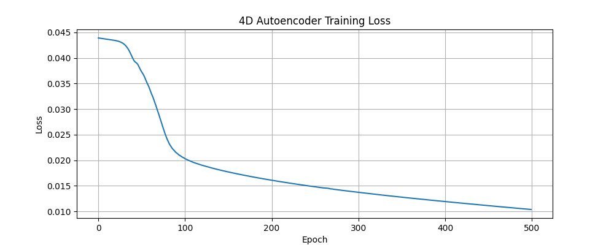 |

| 5D Layer | 6D Layer |
|:---:|:---:|
| 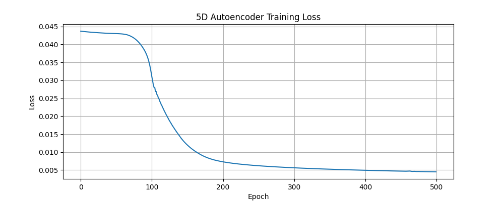 | 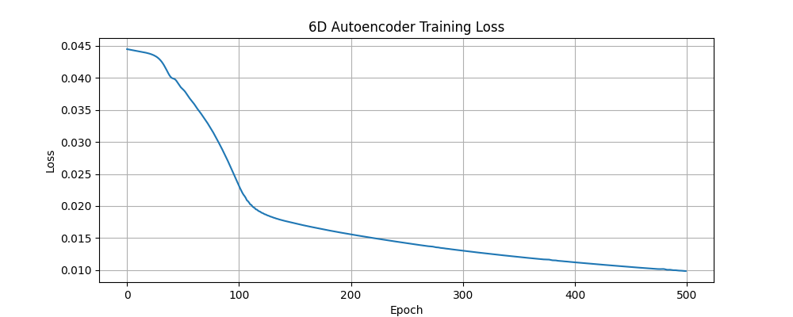 |

Note: Training times increased considerably as the dimensionality increased.
### Reconstruction Quality

## Pokémon Dataset Experiments

In addition to the grayscale image experiments, we also applied our autoencoder architectures to a dataset of 151 Pokémon sprites from the first generation games.

### Reconstruction

Each model attempts to reconstruct the original Pokémon sprites. Below are the reconstruction results:

| 2D Layer | 3D Layer |
|:---:|:---:|
| 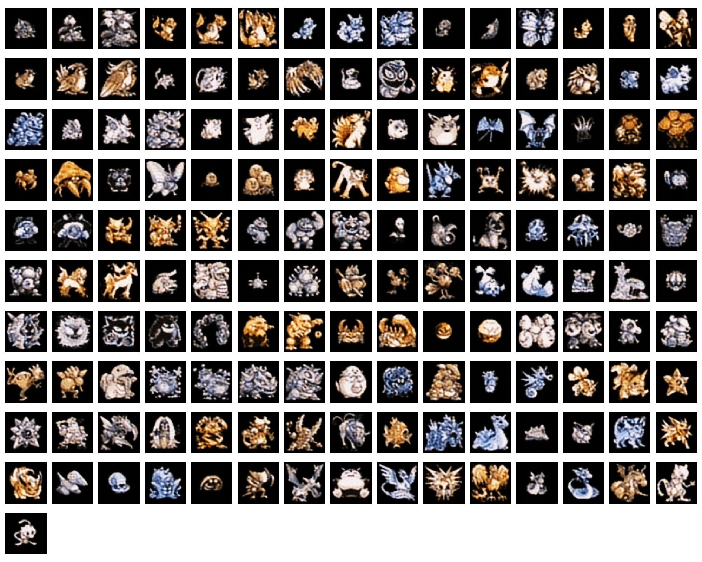 | 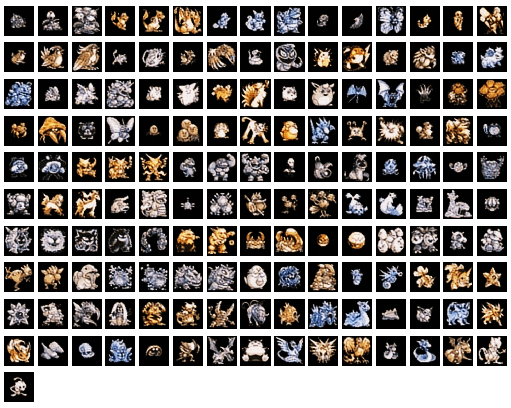 |

| 4D Layer |  |
|:---:|:---:|
| 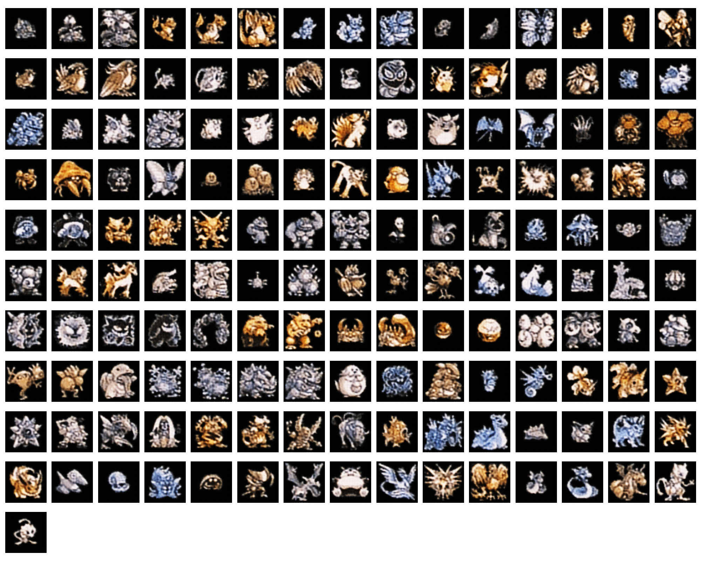 |　 |

### Combined Training Loss

The following graph shows the training loss curves for all Pokémon autoencoder models together:

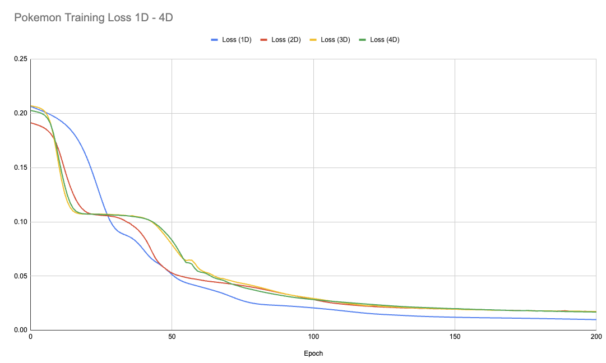

### Training Loss

Below are the individual training loss curves for the Pokémon autoencoder models:

| 2D Layer | 3D Layer |
|:---:|:---:|
| 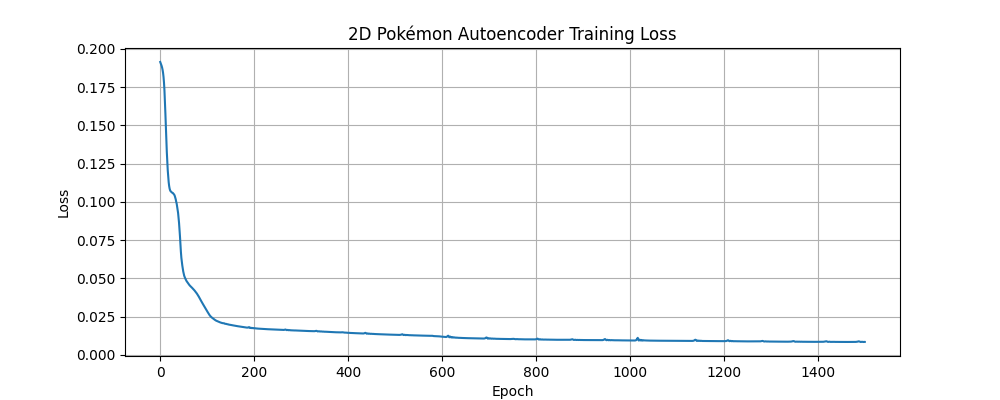 |  |

| 4D Layer |  |
|:---:|:---:|
| 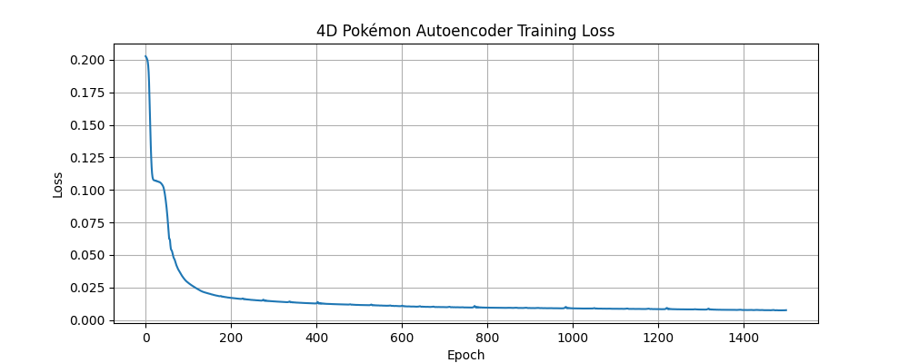 |  |
